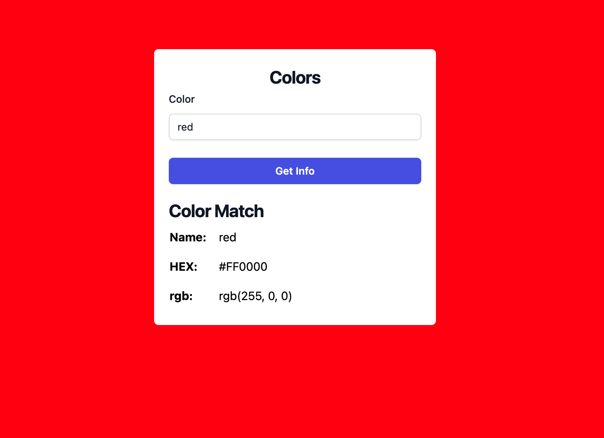
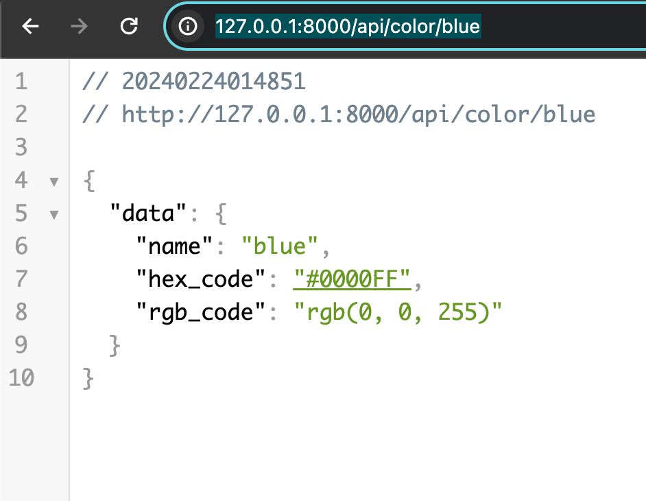

# Installation

Im using Laravel Framework 10.45.1 as I created this project.
php version 8.3.1.
I used database seeder to populate the database with some color names and their hex and rgb codes. 

In the front end, I used a simple form to get the color name from the user and display the color name, hex code, and rgb code.

## Steps

- Clone the repository
- cd to the project directory "color-info"
- Copy the .env.example file to .env and fill in the necessary information
```dotenv
DB_CONNECTION=mysql
DB_HOST=127.0.0.1
DB_PORT=3306
DB_DATABASE=color
DB_USERNAME=username
DB_PASSWORD=password
```
- Run the following commands
```bash
composer install
php artisan key:generate
php artisan migrate:fresh --seed
```
- Run the following command to start the server
```bash
php artisan serve
```
- Visit the following URL in your browser
```url
   INFO  Server running on [http://127.0.0.1:8000].  
```

# Usage
- Input the color name in the text field then click Get Info button or you can hit enter
- Every time you change the color name, the background color of the page will change to the color you entered.

### screenshot


# API version
- Visit the following URL in your browser. 
- note: replace blue with the color name you want to get information about.
```url
   http://127.0.0.1:8000/api/color/blue
```
- You should get a response similar to the following
```json
{
    "data": {
        "name": "blue",
        "hex_code": "#0000FF",
        "rgb_code": "rgb(0, 0, 255)"
    }
}
```
### screenshot


# Files used

List of all the files used or edited in this project.

Controllers and Resources
- app/Http/Controllers/ColorApiController.php
- app/Http/Resources/ColorResource.php

Models
- app/Models/Color.php

Database
- database/migrations/2024_02_23_103941_create_colors_table.php

Seeders
- database/seeders/ColorSeeder.php

Routes
- routes/api.php
- routes/web.php

Views
- resources/views/welcome.blade.php

# Unit Testing

- Run the following command to run the unit tests
```bash
php artisan test
```
- You should get a response similar to the following
```bash
  PASS  Feature\ColorApiTest
  ✓ the application returns a successful response                                                                                                                                                          0.05s  
  ✓ the application returns a not found color response                                                                                                                                                     0.01s  
  ✓ the application returns a found color response                                                                                                                                                         0.01s  

  Tests:    3 passed (3 assertions)
```

# Unit Testing Files

- tests/Feature/ColorApiTest.php


